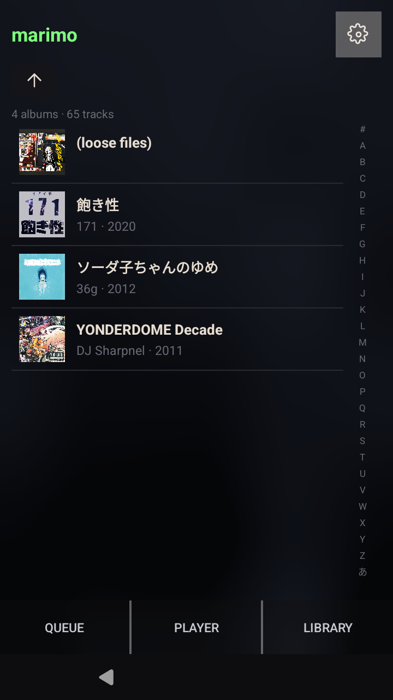
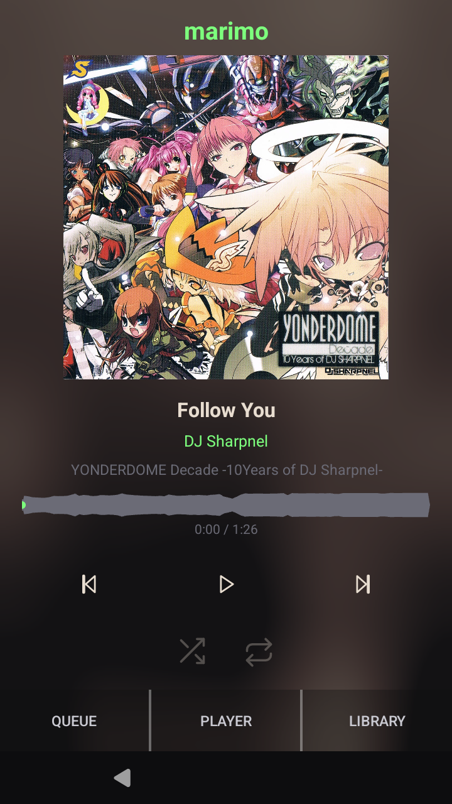
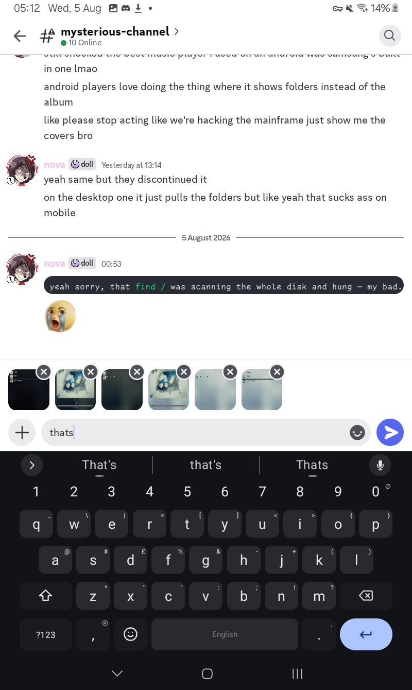
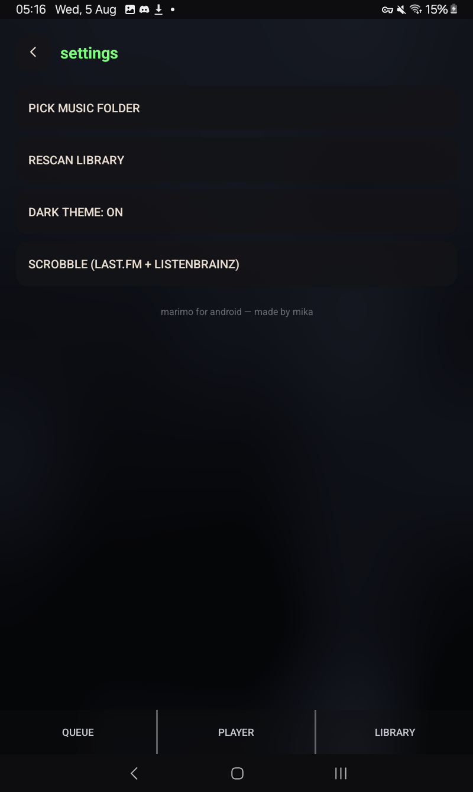

# marimo · android 

A tiny retro green pixel music player — the **[mikaplay](https://github.com/mika-umbrella)** desktop marimo, ported to Android.

<p>
  
  
  
  
</p>

## what it does

- **art-drift background** — the window's backdrop is a tileable perlin field sampled from whichever album is playing, drifting gently while music plays and holding still when it's quiet
- **light & dark themes** — translucent panels, a toggle in settings, everything follows
- **gapless playback** — ExoPlayer runs track-to-track without a gap, so continuous albums (DJ mixes, live sets) flow straight through
- **real waveform** — decoded per track and cached to disk (~104 bytes each), so it pops in instantly on repeat listens
- **queue** — press-and-hold to drag-reorder, swipe away to remove, and it survives restarts (with album covers, no less)
- **scrobbling** — last.fm (with an interactive browser login — no hunting for session keys) + ListenBrainz, same rules as desktop (≥50% or ≥4 min)
- **folder covers** — embedded art, or `cover.jpg`/`folder.jpg` in the album folder

## building

```bash
# 1. build the C core (a VPATH + NDK cross-compile lands a .so per ABI):
cd android && make            # needs the NDK at ~/android-sdk/ndk
cd ..
# 2. build the APK:
JAVA_HOME=$HOME/jdk21 ~/gradle-dl/gradle-8.14.3/bin/gradle assembleDebug --no-daemon
# apk → app/build/outputs/apk/debug/app-debug.apk

# 3. install:
adb install -r app/build/outputs/apk/debug/app-debug.apk
```

Requires **Android 7+** (minSdk 24), Java 17, Gradle 8.14, AGP 8.7. The APK ships both `armeabi-v7a`/`arm64-v8a` and `x86_64` cores, so it runs on real phones **and** x86 emulators/waydroid.

## notes

- pick your music folder from **Settings → Pick music folder** (SAF tree grant).
- adb-pushed audio on emulators/waydroid can be missed by the media provider — marimo falls back to reading those files by path, so freshly sideloaded albums still get tags + art + playback.
- scrobble in **Settings → scrobble** — the last.fm login opens the authorize page in your browser and returns silently.

---

made by [mika](https://github.com/mika-umbrella) for nova :3
