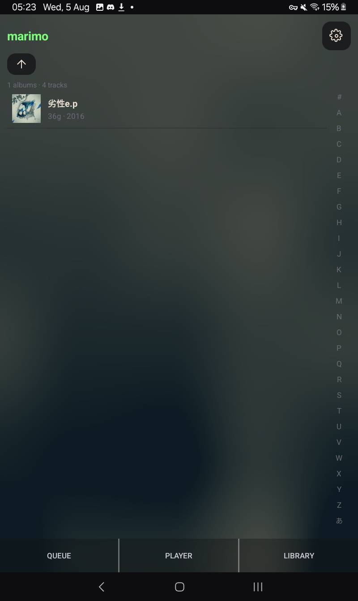
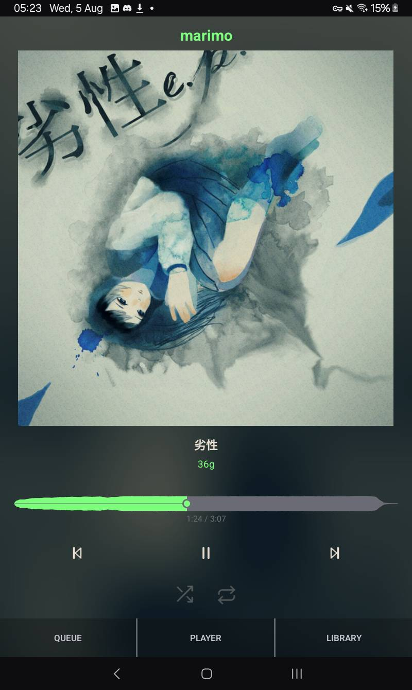
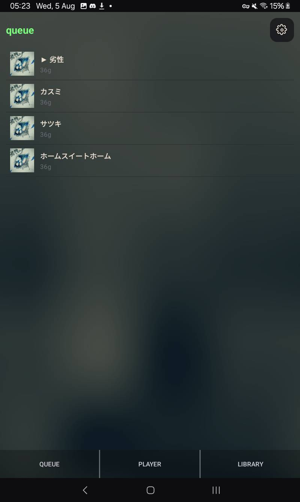
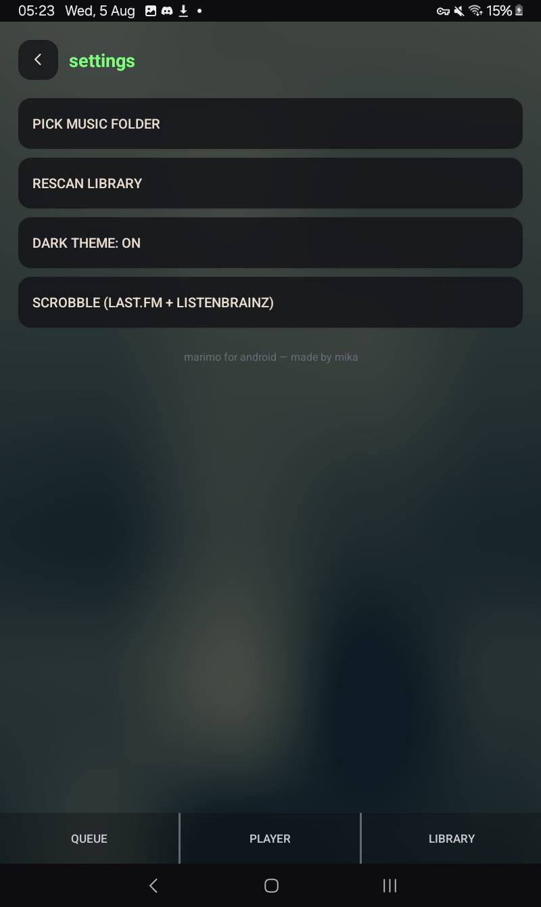
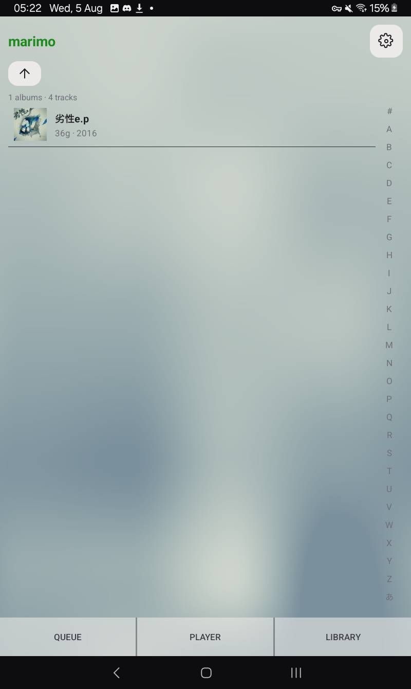
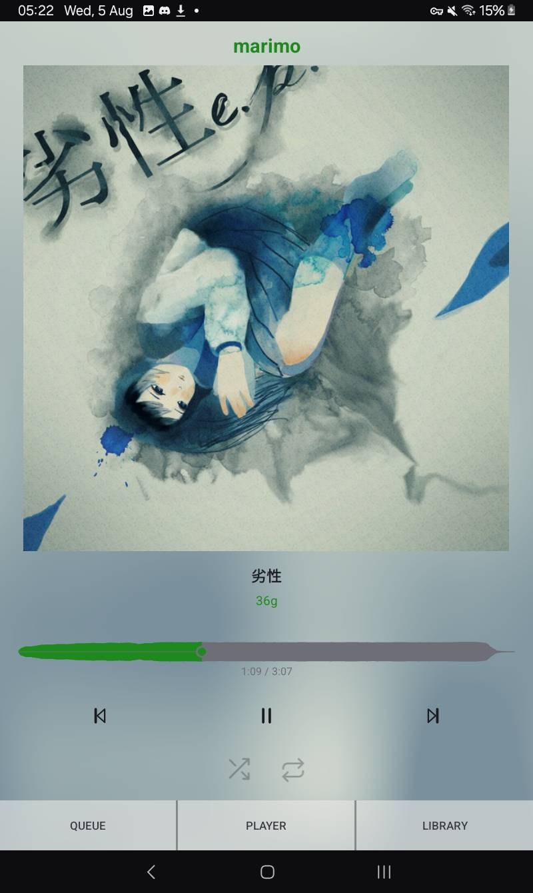
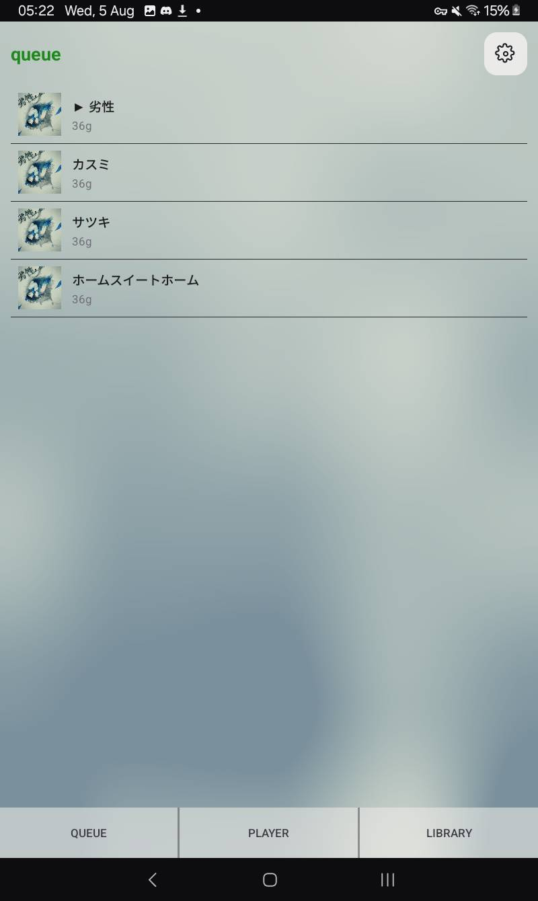
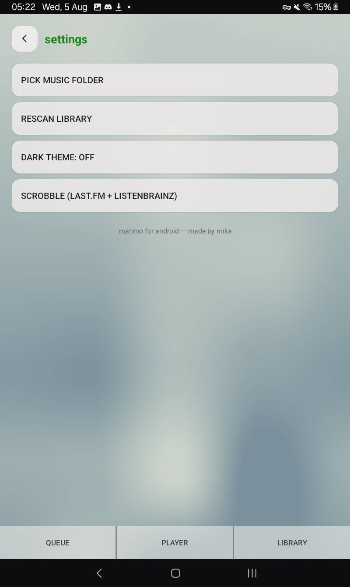

# marimo · android 

A tiny retro green pixel music player — the **[mikaplay](https://github.com/mika-umbrella)** desktop marimo, ported to Android.

**dark theme**

<p>
  
  
  
  
</p>

**light theme**

<p>
  
  
  
  
</p>

## what it does

- **art-drift background** — the window's backdrop is a tileable perlin field sampled from whichever album is playing, drifting gently while music plays and holding still when it's quiet
- **light & dark themes** — translucent panels, a toggle in settings, everything follows
- **gapless playback** — ExoPlayer runs track-to-track without a gap, so continuous albums (DJ mixes, live sets) flow straight through
- **real waveform** — 96 RMS peaks per track, decoded once and cached to disk; ship a precomputed `waves.marimo` sidecar with an album (below) and there is no decode at all
- **queue** — press-and-hold to drag-reorder, swipe away to remove, and it survives restarts (with album covers, no less)
- **scrobbling** — last.fm (with an interactive browser login — no hunting for session keys) + ListenBrainz, same rules as desktop (≥50% or ≥4 min)
- **folder covers** — embedded art, or `cover.jpg`/`folder.jpg` in the album folder

## waveform sidecars (optional)

Decoding a track's waveform on-device takes a few seconds (Android runs the audio decoder in a separate
process and charges ~300 µs per buffer hand-off) — paid once per track, then cached to disk. You can skip
it entirely by precomputing the peaks somewhere with `ffmpeg`:

```bash
python3 tools/make-waveforms.py /path/to/music                       # in place, ~0.2s per track
python3 tools/make-waveforms.py /path/to/music --jobs 8              # more parallelism
python3 tools/make-waveforms.py /path/to/music --outdir /tmp/mirror  # write elsewhere first
```

That writes one small `waves.marimo` per album folder, next to the audio (~1–10 KB per album). It travels
with the album however you copy albums across, and the app reads it during the library scan — albums
without a sidecar just decode as before. Re-run it after adding or renaming an album: entries are looked up
by filename, so a rename invalidates one. Then run **Settings → rescan** once on the phone (the app
restores from its cache on launch and only reads sidecars during a scan).

Format, if you would rather generate it yourself:

```
"MWAVS001" | uint32 LE count | (uint16 LE name length | filename UTF-8 | 96 peak bytes) *
```

The peaks are the same values the app computes for itself: RMS per bucket, sqrt curve, normalised by the
95th percentile, clamped to 4..100. The reader is
`app/src/main/java/moe/umbrella/marimo/WaveSidecar.java`, and `WaveSidecarTest` checks it against a file the
generator actually produced. Requires `python3` + `ffmpeg`. **Don't lower the decode rate below 8 kHz** —
the resampler trims the end of the stream and the last bars collapse.

## building

```bash
# 1. build the C core (a VPATH + NDK cross-compile lands a .so per ABI):
cd android && make            # needs the NDK at ~/android-sdk/ndk
cd ..
# 2. build the APK:
JAVA_HOME=$HOME/jdk21 ~/gradle-dl/gradle-8.14.3/bin/gradle assembleDebug --no-daemon
# apk → app/build/outputs/apk/debug/app-debug.apk

# 3. install:
adb install -r app/build/outputs/apk/debug/app-debug.apk
```

Requires **Android 7+** (minSdk 24), Java 17, Gradle 8.14, AGP 8.7. The APK ships both `armeabi-v7a`/`arm64-v8a` and `x86_64` cores, so it runs on real phones **and** x86 emulators/waydroid.

## notes

- pick your music folder from **Settings → Pick music folder** (SAF tree grant).
- adb-pushed audio on emulators/waydroid can be missed by the media provider — marimo falls back to reading those files by path, so freshly sideloaded albums still get tags + art + playback.
- scrobble in **Settings → scrobble** — the last.fm login opens the authorize page in your browser and returns silently.

---

made by [mika](https://github.com/mika-umbrella) for nova :3
